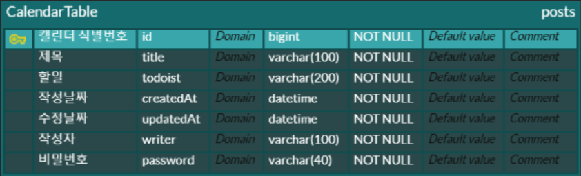

| 캘린더 API 설계하기 |                |                 |       |     |        |
|-----|----------------|-----------------|-------|-----|--------|
|**기능**|**Method**|**URL**|**request**|**response**|**상태코드**|
|일정 등록|<code>POST</code>|/api/calendae|요청 body{}| 등록정보|201: 정상 등록|
|일정 조회|<code>GET</code>|/api/calendae/{id}|요청 param| --- |200: 정상 조회|
|일정 목록 조회| <code>GET</code>| /api/calendae|요청 param|다건 응답 정보|200: 정상 조회|
|일정 수정| <code>PUT</code>|/api/calendae/{id}|요청 body| 수정 정보|200: 정상 수정|
|일정 삭제| <code>PUT</code>|/api/calendae/{id}|요청 body| 수정 정보|200: 정상 삭제|

