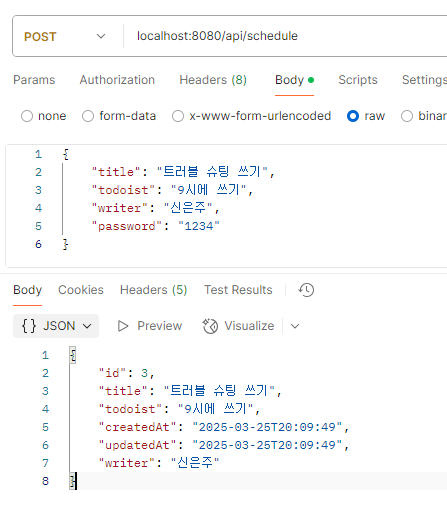
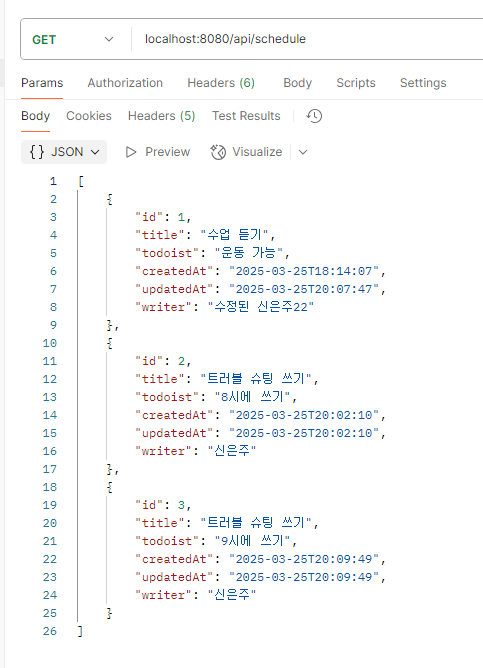
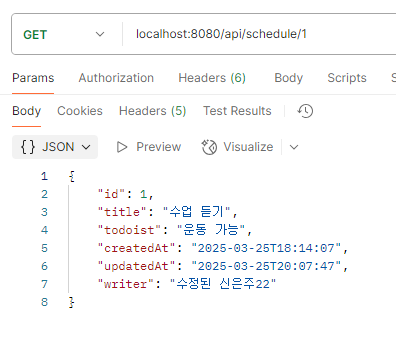
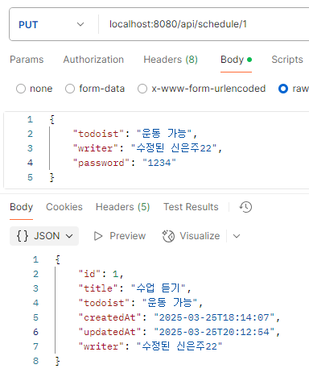
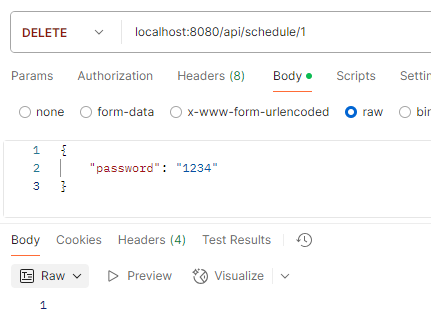

# Calendar Project 📅

## 프로젝트 소개 💻

간단한 일정 관리 웹 애플리케이션으로, Spring Framework의 기초를 학습하고 실습하기 위한 프로젝트입니다.

## 개발 기간 🕰️

- 2025.03.19 수 - 2025.03.26 수

## 프로젝트 목적 🎯

- Spring Framework 기본 기능 학습
- RESTful API 설계 및 구현 연습
- 일정 관리 시스템의 기본 기능 구현

## API 명세서 📋

### 일정 관리 엔드포인트

| 기능 | 메서드 | URL | 요청 예시 | 응답 예시 | 상태 코드 |
|------|--------|-----|-----------|-----------|-----------|
| 일정 등록 | `POST` | `/api/calendae` | ```json { "title": "팀 회의", "todoist": "데일리 스크럼", "writer": "신은주", "password": "1234" }``` | ```json { "id": 1, "title": "팀 회의", "todoist": "데일리 스크럼", "createdAt": "2025-03-25T09:09:49", "updatedAt": "2025-03-25T20:09:49", "writer": "신은주" }``` | 201: 정상 등록 |
| 일정 목록 조회 | `GET` | `/api/calendae` | - | ```json [{ "id": 1, "title": "팀 회의", "todoist": "데일리 스크럼", "updatedAt": "2025-03-25T20:09:49", "writer": "신은주"}]``` | 200: 정상 조회 |
| 특정 일정 조회 | `GET` | `/api/calendae/{id}` | - | ```json { "id": 1, "title": "팀 회의", "todoist": "데일리 스크럼", "updatedAt": "2025-03-25T20:09:49", "writer": "신은주"} ``` | 200: 정상 조회 |
| 일정 수정 | `PUT` | `/api/calendae/{id}` | ```json { "todoist": "데일리 스크럼 보류", "writer": "신은주", "password": "1234" }``` | ```json { "id": 1, "title": "팀 회의", "todoist": "데일리 스크럼 보류", "createdAt": "2025-03-25T09:09:49", "updatedAt": "2025-03-25T20:09:49", "writer": "신은주" }``` | 200: 정상 수정 |
| 일정 삭제 | `DELETE` | `/api/calendae/{id}` | ```json { "password": "1234" }``` | - | 200: 정상 삭제 |

## 개발 단계 🚀

### Lv.0: 설계 및 계획
- API 명세서 작성
- ERD 설계
- SQL 쿼리 준비

### Lv.1: 기본 기능 구현
- 일정 생성
- 전체 일정 조회
- 개별 일정 조회

### Lv.2: 고급 기능 구현
- 일정 수정
- 일정 삭제

## 실행 화면 🖥️

| 일정 등록 | 일정 목록 조회 | 일정 조회 | 일정 수정 | 일정 삭제 |
|----------|--------------|-----------|-----------|-----------|
|  |  |  |  |  |

## 추가 정보 ℹ️

- 자세한 SQL 스크립트는 [schedule.sql](schedule.sql) 참조
- ERD 다이어그램: 